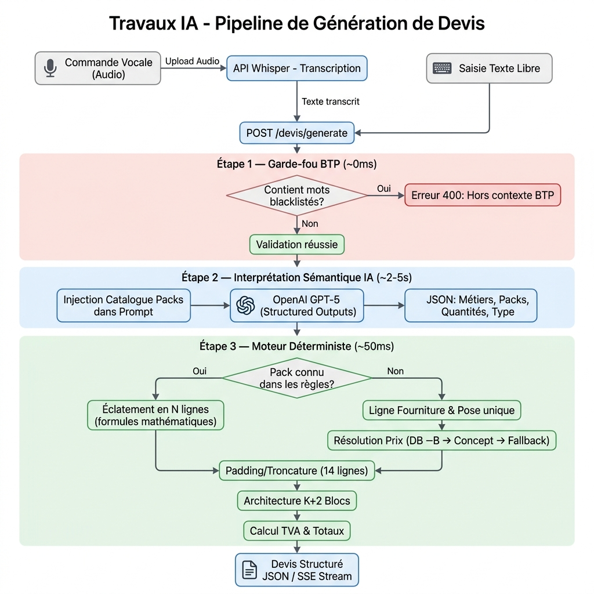

# Architecture et Workflow : Générateur de Devis IA

Ce document présente l'analyse approfondie du pipeline de génération de devis de Travaux IA, depuis l'entrée de l'utilisateur (texte ou voix) jusqu'au devis final structuré.

---

## 1. Vue d'ensemble du Workflow (Diagramme)

Voici le diagramme de flux (flowchart) détaillant les étapes de la génération d'un devis :

---

## 2. Analyse détaillée du Pipeline

Le pipeline repose sur un principe architectural strict : **L'IA ne calcule aucun prix.** Elle agit uniquement comme un "routeur sémantique" qui traduit le langage naturel en identifiants métiers. Toute la mathématique et le chiffrage sont délégués à un moteur Python déterministe.

### Étape 0 : Entrée et Transcription (Optionnel)
- Si l'utilisateur utilise la voix, le fichier audio passe d'abord par le routeur `/voice` qui utilise **OpenAI Whisper** pour transcrire l'audio en texte.
- Le texte (transcrit ou saisi directement) est envoyé au endpoint `/devis/generate` (ou sa version streaming `/devis/generate/stream`).

### Étape 1 : Garde-fou BTP (Blacklist) — *0 ms*
- Le texte est analysé à l'aide d'expressions régulières (`\b`) contre une blacklist de termes non liés au BTP (nourriture, vêtements, loisirs, etc.).
- **Si détecté :** Blocage instantané (HTTP 400), économisant du temps et des tokens d'API.

### Étape 2 : Interprétation Sémantique (IA OpenAI) — *2-5s*
- **Entrée :** Le texte libre de l'utilisateur + le `SYSTEM_PROMPT_GENERATOR` contenant le catalogue dynamique des métiers et des packs.
- **Modèle :** `gpt-5` avec `temperature=1` et le système "Structured Outputs" (`response_format: json_schema`) pour garantir la forme de la réponse.
- **Rôle :** Identifier les corps de métier impliqués, la nature du projet (neuf/rénovation), le type de client (pro/particulier), et lister les "packs" nécessaires avec leurs quantités détectées.
- **Sortie :** Un objet JSON strict décrivant les lots d'intervention, mais **sans aucun prix ni calcul.**

### Étape 3 : Moteur Déterministe et Chiffrage — *~50 ms*
Le moteur `prestations_engine.py` prend le relais. Il itère sur chaque lot détecté par l'IA :

1. **Résolution du Pack (Connu vs Fallback) :**
   - **Branche A (Packs Connus) :** Si l'IA a détecté un pack précis existant dans les `metier_rules.py` (ex: `CARRELAGE_SOL`), le moteur éclate le pack en sous-lignes spécifiques (Carrelage, Colle, Joint, Croisillons, Primaire) en utilisant des formules mathématiques liées à la surface (ex: `surface * 5` pour la colle).
   - **Branche B (Packs Inconnus/Fallback) :** Si le métier n'a pas de règles spécifiques, une ligne principale générique est créée. Le système déduit automatiquement l'unité appropriée selon la quantité (ex: >10 → `m²`, ==1 → `forfait`).

2. **Résolution des Prix (Cascade à 4 niveaux) :**
   - **Niveau 1 :** Prix de matériaux hardcodés.
   - **Niveau 2 :** Correspondance exacte en base de données (`bpu_items`).
   - **Niveau 3 :** *Concept Map*, recherche par mots-clés dans la désignation (ex: "split" trouve l'article de climatisation).
   - **Niveau 4 :** Prix fallback statiques par unité (ex: `m²` = 45€).

3. **Génération de l'Architecture (Padding et Troncature) :**
   - Pour assurer une présentation professionnelle et constante, le moteur force une structure **"K + 2 Blocs"** (Mise en place, Interventions métier, Nettoyage).
   - Le moteur force exactement **14 lignes** par lot d'intervention (ou 3 pour un dépannage). S'il manque des lignes, il génère des prestations annexes intelligentes ("padding", ex: Repérage, Percements) avec des étiquettes spécifiques au métier, tout en répartissant 15% du prix sur ces lignes manquantes.

4. **TVA et Totaux :**
   - La TVA est appliquée (5.5% si isolation/énergétique, 20% pour pro/neuf, 10% par défaut).
   - Les totaux globaux (HT, TVA détaillée, TTC) sont calculés de manière purement arithmétique.

---

## 3. Streaming (SSE)

Si l'endpoint `/devis/generate/stream` est utilisé, les événements progressent ainsi :

| Étape | Événement SSE | Description |
|-------|--------------|-------------|
| 1 | `event: progress` `{"label": "Analyse"}` | Garde-fou BTP (blacklist) |
| 2 | `event: progress` `{"label": "Generate"}` | Appel IA OpenAI |
| 3 | `event: progress` `{"label": "Calculate"}` | Moteur déterministe (prix, padding, structure) |
| 4 | `event: progress` `{"label": "Finalise"}` | Formatage final du devis |
| 5 | `event: result` `{ ...DevisResponse... }` | Devis JSON complet |
| 6 | `event: done` `{}` | Fin du flux |

---

## 4. Fichiers clés du pipeline

| Fichier | Rôle |
|---------|------|
| `app/api/routers/devis.py` | Routes HTTP (JSON + SSE streaming) |
| `app/api/routers/voice.py` | Transcription vocale (Whisper) |
| `app/services/ai_service.py` | Orchestrateur du pipeline (appels IA + moteur) |
| `app/core/btp_validator.py` | Garde-fou blacklist/whitelist |
| `app/core/prompts.py` | Prompts système pour l'IA |
| `app/core/metier_rules.py` | Règles métier (formules mathématiques par pack) |
| `app/services/prestations_engine.py` | **Cœur du moteur** — prix, padding, structure, totaux |
| `app/schemas/devis.py` | Schéma Pydantic de la réponse finale |

---

> **Généré automatiquement** — 30 juin 2026
